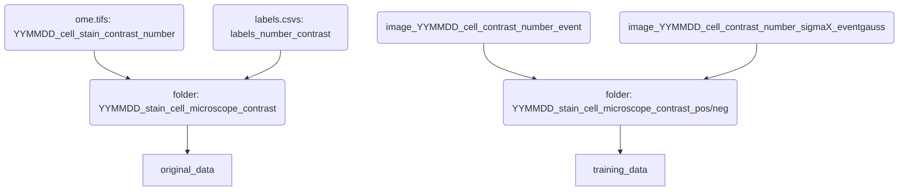

This is the organisation at the moment.



The goal is to make something that is as flat as possible for training_data and have an easy system
to look up the things we want to see. Here is an idea:

```mermaid
graph TD;


```